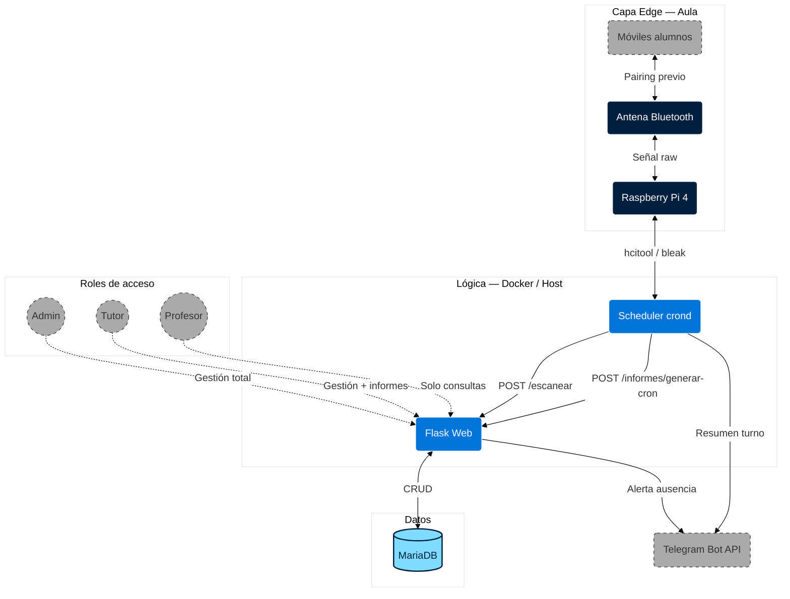

# 📡 Asistenciator — Control de Asistencia por Bluetooth


> Sistema IoT para control automático de asistencia en aulas mediante escaneo pasivo de direcciones MAC Bluetooth, diseñado para Raspberry Pi 4 y desplegado con Docker Compose.

---

## ✨ Características

- **Escaneo Bluetooth automático** cada N minutos (configurable), usando un método híbrido Bluetooth clásico + BLE.
- **Panel web completo** con autenticación por roles (admin / tutor / profesor).
- **Dashboard en tiempo real** con paneles separados de mañana y tarde, estado por alumno y auto-refresco inteligente.
- **Horarios dinámicos** configurables por asignatura, día y aula; soporte de recreos de mañana y tarde.
- **Notificaciones Telegram** con alertas de ausencia individuales y resumen automático al final de cada turno.
- **Correo al tutor legal** configurable por alumno con cuenta Gmail + contraseña de aplicación.
- **Informes semanales HTML** generados automáticamente cada viernes a las 23:59, con barra de asistencia, faltas detalladas y filtros interactivos.
- **Página de Asistencia Total** (admin/tutor) con estadísticas acumuladas por clase y por día completo.
- **Modo reposo en fin de semana**: el sistema no escanea sábados ni domingos; las tareas automáticas corren el viernes.
- **Seguridad integrada**: CSRF, rate limiting, cookies seguras, timeout de sesión, política de contraseñas seguras.
- **Acceso remoto sin abrir puertos** gracias a Cloudflare Tunnel (HTTPS real, sin necesidad de IP pública).

---

## 🏗️ Arquitectura



---

## 📂 Estructura del proyecto

```
asistenciator-bluetooth-attendance/
├── docker-compose.yml          # Orquestación de los 4 servicios
├── .env.example                # Plantilla de variables de entorno
├── logrotate.conf              # Rotación de logs del sistema
│
├── frontend/                   # Servidor web Flask
│   ├── app.py                  # Rutas, lógica y autenticación
│   ├── detector.py             # Módulo de detección Bluetooth
│   ├── metodo_06_hibrido.py    # Detección híbrida L2CAP + PyBluez (método activo)
│   ├── generar_informe.py      # Generador de informes HTML semanales
│   ├── requirements.txt
│   ├── Dockerfile
│   ├── templates/              # Jinja2 — interfaz web
│   ├── static/                 # CSS, JS, imágenes
│   └── notificaciones/
│       ├── telegram_bot.py     # Alertas y resúmenes de turno por Telegram
│       └── correo.py           # Correo al tutor legal (Gmail + SMTP)
│
├── scheduler/                  # Contenedor Alpine con crond
│   ├── Dockerfile
│   ├── crontab                 # Escaneo cada 10 min (L-V) + informe viernes 23:59
│   ├── escaneo.sh              # Llama a POST /escanear con X-Scheduler-Key
│   └── informe.sh              # Llama a POST /informes/generar-cron
│
├── db/
│   └── scripts/
│       └── init.sql            # Esquema inicial MariaDB
│
├── scripts/
│   ├── backup.sh               # Dump comprimido de la BD
│   ├── instalar_cron_backup.sh # Instala el cron de backup automático
│   └── restaurar.sh            # Restauración desde dump
│
└── docs/
    ├── db_diagram.mmd          # Diagrama E/R actualizado (Mermaid)
    ├── project_architecture_diagram.mmd
    ├── guide.md                # Guía de despliegue paso a paso
    └── DRP.md                  # Plan de recuperación ante desastres
```

---

## 🗄️ Modelo de datos

Ver el diagrama completo actualizado en [`docs/db_diagram.mmd`](docs/db_diagram.mmd).

Tablas principales:

| Tabla | Descripción |
|---|---|
| `usuarios` | Cuentas del sistema (admin / tutor / profesor) |
| `alumnos` | Alumnado con MAC Bluetooth, grupo y turno |
| `asignaturas` | Materias impartidas |
| `asignatura_profesores` | Relación N:M profesores ↔ asignaturas |
| `horarios` | Franjas horarias por asignatura, día y aula |
| `matriculas` | Qué alumnos cursan qué asignaturas |
| `asistencia` | Registro granular PRESENTE/AUSENTE por clase |
| `estado_alumno_dia` | Estado diario consolidado (para dashboard) |
| `configuracion` | Parámetros del sistema en caliente (recreos, horarios, etc.) |
| `informes` | Informes HTML semanales almacenados |

---

## 🚀 Despliegue rápido

### Prerrequisitos

- Raspberry Pi 4 con Raspberry Pi OS (64-bit recomendado)
- Docker + Docker Compose instalados
- Adaptador Bluetooth integrado o USB (hci0)
- Cuenta en [Cloudflare](https://cloudflare.com) (para acceso remoto HTTPS)

### Pasos

```bash
# 1. Clonar el repositorio
git clone https://github.com/tu-usuario/asistenciator-bluetooth-attendance.git
cd asistenciator-bluetooth-attendance

# 2. Crear el fichero de entorno
cp .env.example .env
# Editar .env y rellenar todas las claves (ver sección Variables de entorno)

# 3. Arrancar todos los servicios
docker compose up -d

# 4. Comprobar que todo está levantado
docker compose ps
docker compose logs web --tail 30
```

El panel web queda disponible en `http://localhost:5000` (local) o a través del túnel Cloudflare (remoto con HTTPS).

En el primer arranque, si no hay ningún usuario en la base de datos, el sistema redirige automáticamente a la pantalla de configuración inicial para crear el primer administrador.

### Variables de entorno principales

| Variable | Descripción | Ejemplo |
|---|---|---|
| `MYSQL_ROOT_PASSWORD` | Contraseña root de MariaDB | `s3cr3t_root` |
| `MYSQL_USER` / `MYSQL_PASSWORD` | Usuario de la aplicación | `asistenciator_app` |
| `FLASK_SECRET_KEY` | Clave secreta Flask (mínimo 32 chars) | `python3 -c "import secrets; print(secrets.token_urlsafe(32))"` |
| `SCHEDULER_KEY` | Clave para autenticar al scheduler | igual que arriba |
| `SESSION_COOKIE_SECURE` | `false` (defecto). Cloudflare ya fuerza HTTPS en el navegador. Poner `true` solo si Flask sirve HTTPS directamente sin Cloudflare | `false` |
| `TELEGRAM_TOKEN` | Token del bot de Telegram | obtenido en @BotFather |
| `TELEGRAM_CHAT_ID` | ID del chat destino | obtenido con `/getUpdates` |
| `EMAIL_USER` / `EMAIL_PASSWORD` | Gmail + contraseña de aplicación | |
| `CLOUDFLARE_TUNNEL_TOKEN` | Token del túnel creado en dash.cloudflare.com | `eyJ...` |
| `NOMBRE_CENTRO` | Nombre del centro (aparece en correos) | `Mi Centro Educativo` |
| `TZ` | Zona horaria | `Europe/Madrid` |

Consulta `.env.example` para la lista completa con comentarios.

---

## 🔐 Control de acceso

| Rol | Dashboard | Alumnos/Horarios | Informes | Asistencia Total | Config | Usuarios |
|---|:---:|:---:|:---:|:---:|:---:|:---:|
| **Admin** | ✅ | ✅ | ✅ | ✅ | ✅ | ✅ |
| **Tutor** | ✅ | ✅ | ✅ | ✅ | ✅ | — |
| **Profesor** | ✅ | Solo lectura | — | — | — | — |

---

## 📋 Tareas automáticas (cron)

| Tarea | Horario | Descripción |
|---|---|---|
| Escaneo Bluetooth | Cada minuto, L–V 7:00–22:59 (la app descarta según franja y frecuencia configurada) | Detecta presencia y registra asistencia |
| Resumen de turno | Al final de cada turno | Mensaje Telegram con lista de ausentes |
| Informe semanal | Viernes 23:59 | Genera informe HTML, purga registros individuales |

Los recreos (mañana y tarde) se configuran desde el panel de administración en caliente; durante esas franjas no se realizan escaneos.

---

## 🔧 Método de detección Bluetooth

El sistema utiliza **Método 6 — Híbrido L2CAP + PyBluez fallback**, implementado en `frontend/metodo_06_hibrido.py`. Es el método más fiable del proyecto:

1. **Fase 1 — L2CAP ping** (rápido): intenta conectar al puerto SDP del dispositivo vía socket L2CAP.
2. **Fase 2 — PyBluez lookup_name** (fallback): si L2CAP falla, recurre a una consulta de nombre Bluetooth clásico para recuperar dispositivos que no respondieran al primer intento.

El módulo `detector.py` actúa como interfaz entre `app.py` y el método de detección, exponiendo `encender_bt()`, `escanear_alumnos()` y `nombre_metodo_activo()`.

---

## 📚 Documentación adicional

- [`docs/guide.md`](docs/guide.md) — Guía completa de despliegue, mantenimiento y resolución de problemas
- [`docs/db_diagram.mmd`](docs/db_diagram.mmd) — Diagrama E/R del modelo de datos
- [`docs/DRP.md`](docs/DRP.md) — Plan de recuperación ante desastres

---

## ⚖️ Licencia y Uso

Este proyecto se distribuye bajo la licencia **PolyForm Noncommercial 1.0.0**.

✅ **Permitido:**
* Uso personal y educativo.
* Estudiar el código fuente.
* Proponer mejoras y correcciones vía Pull Request.

❌ **Prohibido:**
* Uso comercial o empresarial.
* Venta del software o de servicios derivados de él.
* Redistribución a terceros con fines lucrativos.

---

<sub>Hecho por [Laura Linares]</sub>
